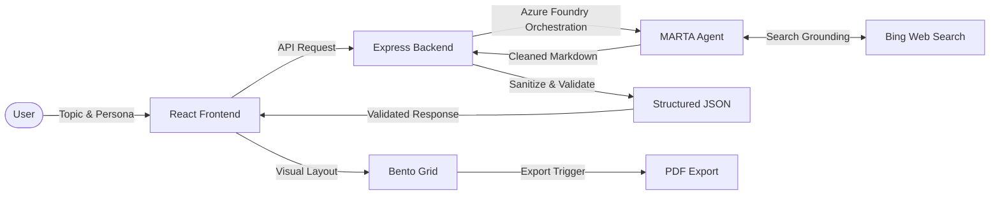

# Structured AI Knowledge Builder
## Stop reading walls of AI text. Start consuming structured knowledge — grounded, cited, and synthesized by MARTA on Azure Foundry IQ.


## 📹 Demo Video
[▶ Watch Full Demo on YouTube](https://www.youtube.com/watch?v=XnnfZWsPxfo)

## The Problem
Most AI tools output walls of text — unorganized Markdown blocks that are difficult to scan, verify, or reuse. Users spend more time parsing LLM responses into useful formats than actually consuming the knowledge. Standard chat interfaces lack spatial hierarchy and often hallucinate technical references.

## The Solution
The Structured AI Knowledge Builder implements an 8-stage synthesis pipeline that orchestrates raw intent into a Neo-Brutalist Bento Grid. By replacing standard chat with an extraction engine, the application ensures every piece of information has a designated functional home — from layman summaries to cited technical sources.

## Architecture



## MARTA — The Foundry IQ Layer
MARTA (Master Orchestrator Agent) is not an LLM wrapper — it is a search-grounded synthesis engine built on Azure AI Foundry.

- **Grounding:** Every response is anchored by Bing Web Search. MARTA retrieves live data before generating content.
- **Zero Hallucination:** By enforcing a strict JSON schema and using search-grounded tools, MARTA eliminates fake URLs and fabricated technical definitions.
- **Orchestration:** MARTA independently handles the transformation of complex topics into 10 distinct knowledge modules.

## 🤖 GitHub Copilot Usage
Built with GitHub Copilot as the primary development assistant throughout the project.

**Verified Microsoft Learn Achievement:** [Introduction to GitHub Copilot — Completed June 5, 2026](https://learn.microsoft.com/en-us/users/ahteshamlatif-8503/achievements/abqryyh7)

**How Copilot was used:**
- Accelerated component scaffolding for all 9 React components
- Assisted with TypeScript type definitions and interface design
- Used for debugging the Azure AI Projects SDK integration
- Helped write the AAA pattern test structure
- Generated boilerplate for Express middleware and route handlers

## Features
- **8-Stage Pipeline:** Visualized tracking of the synthesis process from retrieval to formatting.
- **Persona System:** Contextual framing for Student, Dev, Engineer, Kid, Teacher, Business, and the "Donkey" gamified mode.
- **Bento Grid:** Neo-Brutalist high-contrast UI for maximum information density and scannability.
- **Deep Dive:** Click any card item to populate the input field for instant deep-dive exploration.
- **YouTube Interceptor:** Validates and embeds search-grounded video guides with graceful fallback.
- **PDF Export:** High-fidelity server-side PDF generation via Puppeteer.
- **System Cooling:** Backend rate limiter — 5 requests per 15 minutes per IP.
- **Schema Guard:** Server-side validation ensuring MARTA's output meets the 10-field requirement.

## 🔐 Security & Resilience

| Attack Vector | Behavior | Status |
| :--- | :--- | :--- |
| SQL Injection | Converted to educational content | ✅ Safe |
| Prompt Injection | Blocked by Foundry guardrails | ✅ Safe |
| XSS | Converted to educational content | ✅ Safe |

## Tech Stack

| Component | Technology |
| :--- | :--- |
| **Frontend** | React 19, Vite, Tailwind CSS v4, Framer Motion |
| **Backend** | Node.js, Express, Puppeteer |
| **AI Orchestration** | Azure AI Foundry (MARTA / GPT-4.1-mini) |
| **Grounding** | Bing Web Search API |
| **Language** | TypeScript |

## Quick Start

1. **Clone the repository:**
```bash
   git clone https://github.com/Ahtesham-Latif/AI_KNOWLEDE_BUILDER_BACKED_BY_MARTA.git
   cd AI_KNOWLEDE_BUILDER_BACKED_BY_MARTA
```

2. **Install dependencies:**
```bash
   npm install
```

3. **Setup environment:**
```bash
   cp .env.example .env
```

4. **Login to Azure CLI:**
```bash
   az login
```

5. **Run the development server:**
```bash
   npm run dev
```

## Environment Variables

| Variable | Description |
| :--- | :--- |
| `FOUNDRY_ENDPOINT` | Azure AI Foundry agent endpoint URL |
| `AZURE_CLI_AUTH` | Uses `AzureCliCredential` — run `az login` before starting |

## Project Structure

```text
root/
├── server.ts
├── src/
│   ├── App.tsx
│   ├── services/
│   │   └── knowledgeService.ts
│   ├── components/
│   │   ├── Header.tsx
│   │   ├── InputSection.tsx
│   │   ├── KnowledgeDisplay.tsx
│   │   ├── KnowledgeCard.tsx
│   │   ├── LoaderSkeleton.tsx
│   │   ├── ProcessChain.tsx
│   │   ├── VideoBentoCard.tsx
│   │   ├── YouTubePlayer.tsx
│   │   └── ErrorBoundary.tsx
│   └── types.ts
├── AGENTS.md
└── .env.example
```

## Hackathon Track
- **Track:** Creative Apps
- **Intelligence:** Foundry IQ (MARTA Orchestrator)
- **GitHub Copilot:** Verified usage — Microsoft Learn Achievement June 5, 2026
- **Eligibility:** Student Award (Ahtesham Latif — University of the Punjab, IBIT)

## Known Edge Cases & Future Work
- **Unicode/Emoji:** High-density emoji topics may disrupt server-side PDF font rendering
- **Timeout Retry:** Exponential backoff for Azure Foundry cold starts — planned
- **Web Search Fallback:** Improved logic for sparse Bing results — planned
- **Gravity Mode (V2):** Physics-based Bento Card interaction — planned

## License
MIT

---
**Developer:** Ahtesham Latif
**University:** University of the Punjab (IBIT)
**Hackathon:** Microsoft Agents League — AI Skills Fest 2026