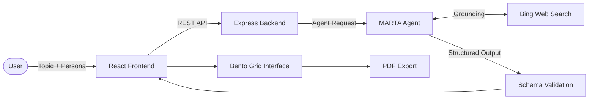

# Structured AI Knowledge Builder

> Transform any topic into structured, grounded, and reusable knowledge using Azure AI Foundry Agents.


---

## 🚀 Overview

Large Language Models are excellent at generating information but often return lengthy, unstructured responses that are difficult to scan, validate, and retain.

Structured AI Knowledge Builder solves this problem by converting a topic into a structured educational artifact through an AI-powered synthesis pipeline. Instead of receiving a wall of text, users receive a curated knowledge experience organized into dedicated learning modules.

Built for the **Microsoft Agents League – AI Skills Fest 2026**, the project demonstrates how Azure AI Foundry Agents can be used to create grounded, reliable, and user-friendly AI experiences.

---

## 📹 Demo

**Watch the Full Project Demo**

[▶ Watch on YouTube](https://www.youtube.com/watch?v=XnnfZWsPxfo)

---

## 📸 Application Preview


---

## ✨ What Makes This Different?

Most AI applications focus on generating more text.

This project focuses on generating **better knowledge**.

Every response is transformed into structured learning modules:

* Plain-English explanation
* Formal definition
* Practical use cases
* Types and classifications
* Step-by-step understanding
* Reflection questions
* Learning resources
* Source references
* Final synthesis

The result is a learning-first experience designed for comprehension rather than conversation.

---

## 🏗️ Architecture



---

## 🤖 Why Azure AI Foundry Agents?

MARTA was intentionally designed as an Azure AI Foundry Agent instead of a simple model call.

The application requires:

* Search grounding
* Multi-step orchestration
* Structured output generation
* Retrieval-augmented responses
* Tool integration
* Validation workflows

Using Azure AI Foundry enables these capabilities while maintaining reliability and separation between retrieval, reasoning, validation, and presentation.

---

## 🧠 MARTA: The Knowledge Synthesis Engine

MARTA is the project's orchestration layer.

### Responsibilities

* Retrieve grounded information
* Analyze and synthesize content
* Generate structured responses
* Preserve citations
* Enforce schema compliance
* Deliver UI-ready knowledge modules

This architecture ensures the frontend only receives validated and predictable data.

---

## 📋 Structured Output Contract

Every generated response must satisfy a strict schema before reaching the UI.

```json
{
  "layman": "...",
  "definition": "...",
  "when_to_use": [],
  "how_to_make": [],
  "types": [],
  "points_to_ponder": [],
  "youtube_id": "...",
  "youtube_fallback": "...",
  "sources": [],
  "conclusion": "..."
}
```

### Validation Benefits

* Prevents malformed AI responses
* Eliminates incomplete generations
* Ensures predictable rendering
* Improves application reliability
* Reduces hallucinated structure

---

## 🎯 Key Features

### AI Knowledge Synthesis

* Azure AI Foundry Agent orchestration
* Search-grounded generation
* Structured response validation
* Citation-aware content generation

### Multi-Persona Learning

Generate explanations tailored for:

* Student
* Developer
* Engineer
* Teacher
* Business Professional
* Kid
* Donkey Mode (A fun UI card)

## 🎭 Persona System in Action

Same complex topic. Completely different knowledge artifact. MARTA adapts everything — depth, language, analogies, and technical detail — based on the target audience.

**Topic:** Transformer Architecture: Multi-Head Self-Attention Mechanism

### 👷 Engineer Mode
- Layman uses architecture pattern analogies
- Steps include actual matrix math: `softmax(QK^T / sqrt(d_k))V`
- Types cover Masked, Cross-Attention, Sparse variants
- Points to Ponder focus on computational complexity and regularization
- Conclusion includes full formal formula: `MultiHead(Q,K,V) = Concat(head_1,...,head_h)W^O`

### 🧒 Kid Mode  
- Layman uses "magical talking book" and "special glasses" metaphors
- Steps simplified to plain English — no matrix notation
- Same formula in conclusion — accuracy preserved despite simplified language
- Sources adapted to beginner-friendly resources

### 📄 Exported PDFs
Both personas export as pixel-perfect high-fidelity PDFs:
- [Engineer Report](./Pictures/transformer_architecture__multi-head_self-attention_mechanism_full_report%20FOR%20Engineer.pdf)
- [Kid Report](./Pictures/transformer_architecture__multi-head_self-attention_mechanism_full_report%20FOR%20KID.pdf)

> MARTA doesn't just change the tone. She rewrites the entire knowledge architecture for the audience.

### Interactive Knowledge Interface

* Neo-Brutalist Bento Grid design
* High information density
* Visual learning hierarchy
* One-click deep dives

### Learning Resources

* YouTube integration
* Video validation
* Fallback support

### Exporting

* Server-side PDF generation
* Downloadable learning reports
* Print-ready formatting

### 📱 Cross-Device PDF Export

High-fidelity PDF export works flawlessly across all devices and screen sizes.

Puppeteer renders the PDF server-side at a fixed 1200px desktop viewport regardless of the requesting device — ensuring every export looks identical whether downloaded on mobile, tablet, or desktop.

- Mobile download ✅
- Tablet download ✅  
- Desktop download ✅
- Print-ready formatting ✅
- Consistent Neo-Brutalist layout preserved across all exports ✅
---

## 🔒 Security & Reliability

| Concern            | Protection                           |
| ------------------ | ------------------------------------ |
| Prompt Injection   | Azure AI Foundry safeguards          |
| Invalid Responses  | Schema validation                    |
| XSS Payloads       | Safe rendering pipeline              |
| Excessive Requests | Express rate limiting                |
| Broken Media Links | URL validation and fallback handling |

### Rate Limiting

```text
5 requests per IP every 15 minutes
```

---

## ⚙️ Technology Stack

| Layer            | Technology                                     |
| ---------------- | ---------------------------------------------- |
| Frontend         | React 19, Vite, Tailwind CSS v4, Framer Motion |
| Backend          | Node.js, Express                               |
| AI Platform      | Azure AI Foundry                               |
| Model            | GPT-4.1 Mini                                   |
| Search Grounding | Bing Web Search                                |
| PDF Generation   | Puppeteer                                      |
| Language         | TypeScript                                     |
| Testing          | Jest                                           |

---

## 🧪 Testing

The project includes automated backend integration tests to verify API reliability, schema validation, and PDF generation workflows.

### Run All Backend Tests

```bash
npm run test:api
```

### Current Status

```text
PASS
6 Tests Passing
0 Tests Failing
```

### Backend Integration Test Coverage

| Endpoint             | Scenario                                    | Status |
| -------------------- | ------------------------------------------- | ------ |
| GET /api/health      | Health check endpoint responds successfully | ✅      |
| POST /api/generate   | Valid MARTA response schema                 | ✅      |
| POST /api/generate   | Missing required request fields             | ✅      |
| POST /api/generate   | Incomplete MARTA schema validation          | ✅      |
| POST /api/export-pdf | Successful PDF generation                   | ✅      |
| POST /api/export-pdf | Missing report data handling                | ✅      |

### What Is Being Validated?

* API availability and health monitoring
* Structured AI response validation
* Required field enforcement
* MARTA schema compliance
* Error handling behavior
* Server-side PDF generation
* Backend reliability under invalid inputs

### Frontend Testing

Frontend UI integration tests are currently being refactored to support ESM-compatible module mocking and expanded component coverage.

Current UI test status does not affect production functionality or backend validation coverage.

```
```

## 🚀 Quick Start

### 1. Clone Repository

```bash
git clone https://github.com/Ahtesham-Latif/AI_KNOWLEDGE_BUILDER_BACKED_BY_MARTA.git

cd AI_KNOWLEDGE_BUILDER_BACKED_BY_MARTA
```

### 2. Install Dependencies

```bash
npm install
```

### 3. Configure Environment Variables

```bash
cp .env.example .env
```

### 4. Authenticate with Azure

```bash
az login
```

### 5. Start Development Server

```bash
npm run dev
```

---

## 🔑 Environment Variables

| Variable         | Description                       | Example                                  |
| ---------------- | --------------------------------- | ---------------------------------------- |
| FOUNDRY_ENDPOINT | Azure AI Foundry Endpoint         | https://your-agent.services.ai.azure.com |
|MARTA_ASSISTANT_ID| Azure AI Agent | your-agent-id|
| AZURE_CLI_AUTH   | AzureCliCredential Authentication | Requires az login                        |

---

## 📂 Project Structure

```text
root/
├── server.ts
├── index.html
├── vite.config.ts
├── tsconfig.json
├── jest.config.js
├── jest.setup.ts
├── ui.test.tsx
├── metadata.json
├── src/
│   ├── App.tsx
│   ├── main.tsx
│   ├── index.css
│   ├── types.ts
│   ├── components/
│   │   ├── Header.tsx
│   │   ├── InputSection.tsx
│   │   ├── KnowledgeDisplay.tsx
│   │   ├── KnowledgeCard.tsx
│   │   ├── LoaderSkeleton.tsx
│   │   ├── ProcessChain.tsx
│   │   ├── YouTubePlayer.tsx
│   │   └── ErrorBoundary.tsx
│   ├── services/
│   │   └── knowledgeService.ts
│   └── lib/
├── tests/
│   └── api.test.ts
├── Pictures/
│   ├── Layout.png
│   └── ahtesham_latif_full_report.pdf
├── Agents.md
├── .env.example
└── README.md
```

---

## 🏆 GitHub Copilot Usage

GitHub Copilot was used throughout development to accelerate engineering workflows.

### Contributions

* Component scaffolding
* TypeScript interfaces
* Express middleware generation
* Testing boilerplate
* Refactoring assistance
* Azure SDK integration support

### Multi-Model AI Development Approach

Different AI models were used strategically based on their strengths:

| Task | Model Used |
| --- | --- |
| Component scaffolding and Express middleware | GitHub Copilot |
| Azure SDK integration debugging | GitHub Copilot |
| Neo-Brutalist design patterns and UI architecture | Claude (Anthropic) |
| Video edit planning and demo script | Gemini Omni |
| Hackathon compliance review | Gemini |
| MARTA system prompt engineering | Claude + Gemini |
| Engineering and Architect Advices | K (Azure Foundry Agent)

This multi-model approach mirrors real-world AI-assisted development — using the right tool for the right task rather than defaulting to a single model for everything.

### AI-Assisted Development Examples

**Prompt used for PDF viewport fix:**
> "In server.ts, the PDF export via Puppeteer is rendering incorrectly on mobile devices. Add setViewport with width 1200, deviceScaleFactor 1, isMobile false before page.setContent(). Force desktop rendering regardless of device."

**Prompt used for MARTA integration:**
> "Replace the /api/generate route with a direct REST call to Azure Foundry Agent MARTA using AzureCliCredential. Read FOUNDRY_ENDPOINT from process.env. Parse the response output array finding type message, extract content text value, clean JSON markdown blocks, parse and return."

**Prompt used for security hardening:**
> "Add backend rate limiting to Express /api/generate using express-rate-limit. 5 requests per 15 minutes per IP. Return custom message: Too many requests. System cooling down."

### Verified Achievement

**Introduction to GitHub Copilot**
Completed June 5, 2026

[](https://learn.microsoft.com/en-us/users/ahteshamlatif-8503/achievements/abqryyh7)

---

## 🔮 Future Enhancements

* Persistent knowledge history
* Multi-language support
* Advanced PDF themes
* Improved retrieval fallback strategies
* Physics-based Bento interactions
* Knowledge comparison mode

---

## 🤝 Contributing

Contributions, suggestions, and feedback are welcome.

1. Fork the repository
2. Create a feature branch
3. Commit your changes
4. Open a pull request

---

## 📄 License

MIT License

---

## 👨‍💻 Author

**Ahtesham Latif**

Business & IT Student
University of the Punjab (IBIT)

### Built For

**Microsoft Agents League – AI Skills Fest 2026**

*"Making AI-generated knowledge easier to understand, verify, and learn from."*
